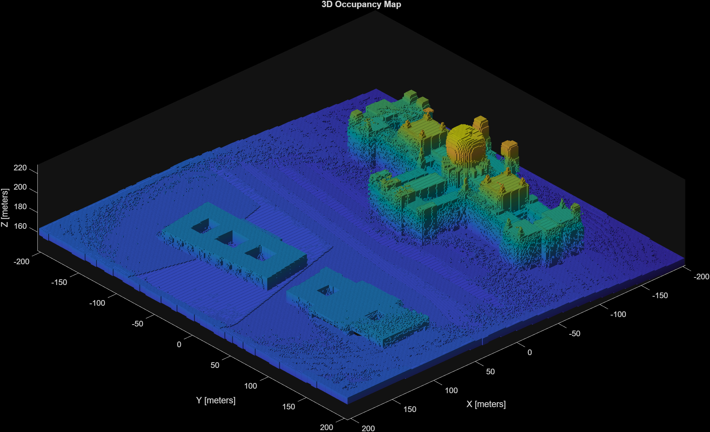
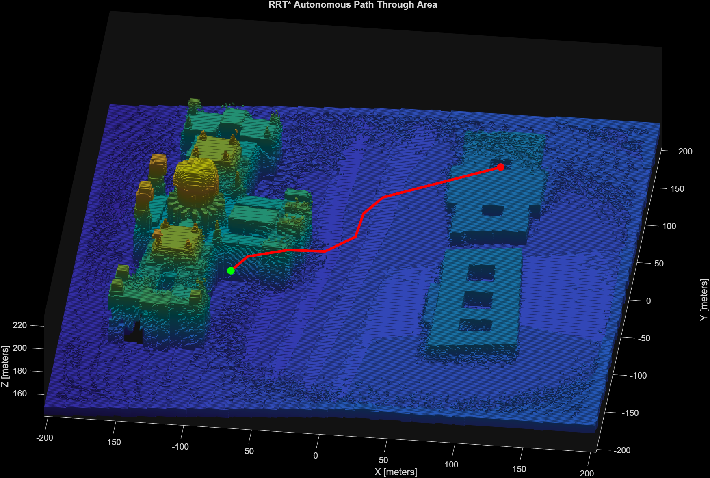
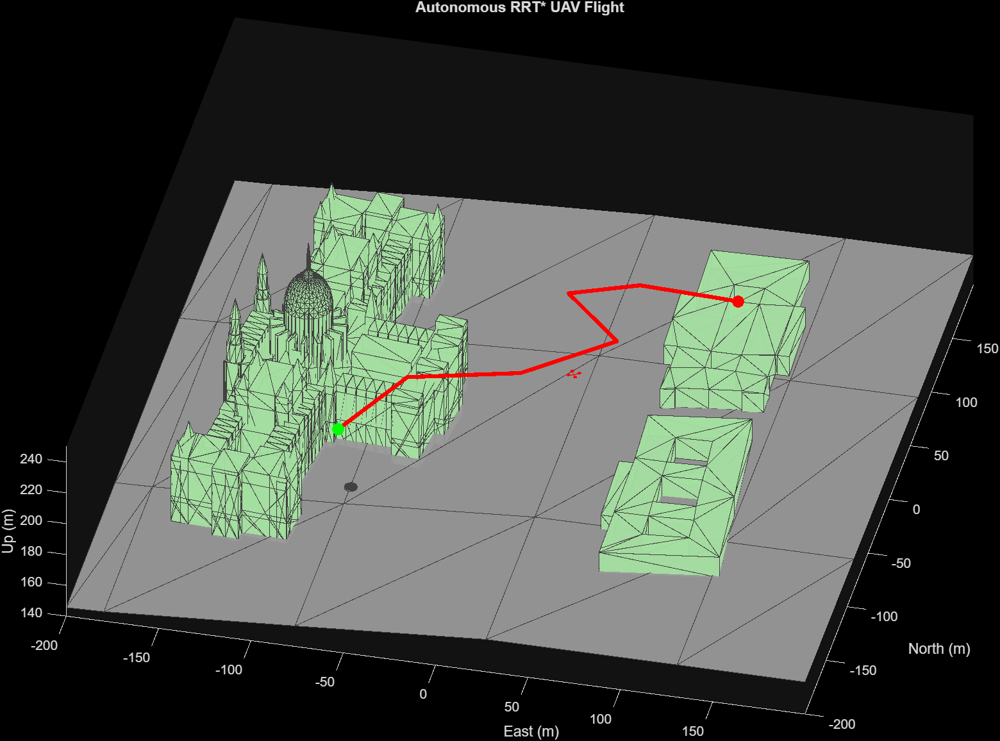
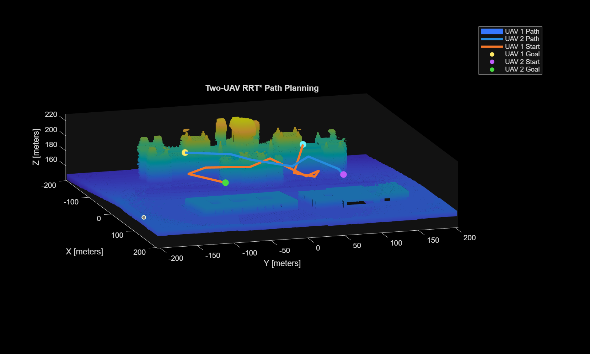
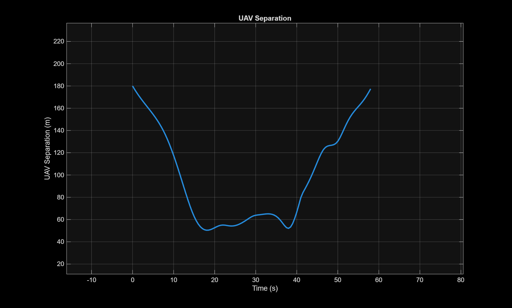

# Multi-UAV-Path-Planning
This project is part of Matlab Simulink Challenge to provide ideas for Unmanned Urban Aerial Mobilty and transit.

## Project Description
1. Our task is to first become familiar with Simulink, Uav tool box, sensor fusion and tracking, and also optimization tool box.
2. Set up cuboid simulation scenario (project should also include multiple static obstackels and also urban env.
3. Develop a 3D path planning algo. using UAV tool box for collision free drone flights
4. Extend that path to multiple drones in single env.
6. Test the algorithm in a cuboid scenario environment with multiple drone flights.
7. Use Sensor Fusion and Tracking Toolbox™ and data from simulated sensors to estimate and track the positions and velocities of all the drones.
8. Develop a task planning algorithm that considers planning pickups, and delivery tasks, and allotting them to appropriate drones. Further, optimize this process using the Optimization toolbox.
9. Complement the 3D path planning algorithm with the task planning algorithm and test them in a photorealistic simulation of an urban environment.
9. Develop a decentralized obstacle avoidance algorithm to avoid obstacles (dynamic/static) if they come in a nearby range. Integrate it with the rest of the system.

## Progress
A 3D urban UAV environment has been created for Budapest and Pécs using real terrain and OpenStreetMap building data.

  
 **Budapest urban OSM**  

### GNSS

|  |
|:--:|
| **GNSS satellite LOS and multipath reception in the scenario.** |

### Single UAV Mission
|  |
|:--:|
| **A simple mission in scenario.** |

### UAV Delivery Mission

|  |
|:--:|
| **Takeoff, waypoint navigation, delivery hover, return, and landing mission.** |

### LiDAR Mapping

A UAV performs an aerial survey of the environment using simulated LiDAR.  
The collected point clouds are used to construct a 3D occupancy map of the surrounding terrain and buildings.

|  |
|:--:|
| **3D occupancy map generated from UAV LiDAR measurements.** |

### Autonomous Path Planning with RRT*

The generated occupancy map is inflated to introduce an obstacle safety margin and is then used by an RRT* planner to generate a collision free 3D route between a start and goal position.

|  |
|:--:|
| **Collision free RRT* path generated through the LiDAR derived occupancy map.** |

### Autonomous UAV Flight

The RRT* path is converted into a UAV trajectory and executed by the same UAV inside the scenario.

|  |
|:--:|
| **UAV executing the automatically generated RRT* trajectory.** |

### RRT Path planning for two UAVs
In the Multi_UAV_Planner file, we used the previous script of the RRT* algorithm and plotted a second UAV using the same algorithm.
|  |
|:--:|
| **Two UAVs with colliding/intersecting RRT* paths** |

Also, for this section I tried to plot the separation graph between two assumed UAVs, so later on we can add a threshold of minimum separation difference so we can predict where the UAVs may collide depending on there path(Useful when the airspace is saturated)
| |
|:--:|
|**You can probably tell the distance is reducing between these two**|