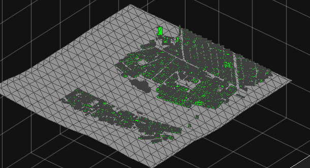
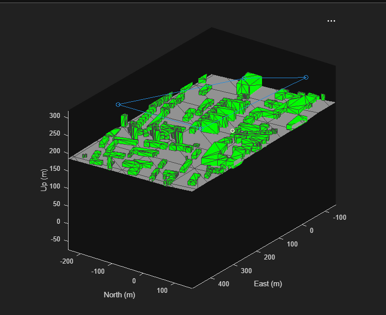
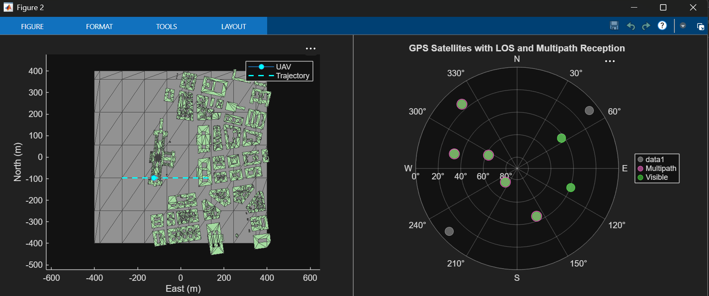
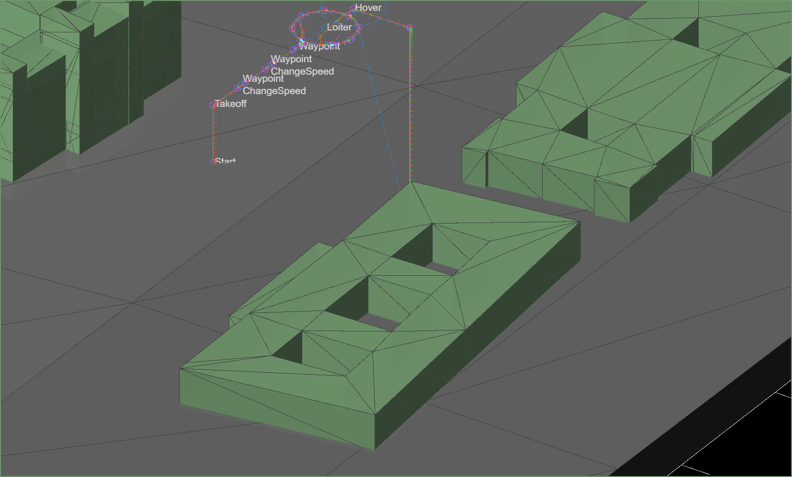

# Multi-UAV-Path-Planning
This project is part of Matlab Simulink Challenge to provide ideas for Unmanned Urban Aerial Mobilty and transit.

## Project Description
1. Our task is to first become familiar with Simulink, Uav tool box, sensor fusion and tracking, and also optimization tool box.
2. Set up cuboid simulation scenario (project should also include multiple static obstackels and also urban env.
3. Develop a 3D path planning algo. using UAV tool box for collision free drone flights
4. Extend that path to multiple drones in single env.
6. Test the algorithm in a cuboid scenario environment with multiple drone flights.
7. Use Sensor Fusion and Tracking Toolbox™ and data from simulated sensors to estimate and track the positions and velocities of all the drones.
8. Develop a task planning algorithm that considers planning pickups, and delivery tasks, and allotting them to appropriate drones. Further, optimize this process using the Optimization toolbox.
9. Complement the 3D path planning algorithm with the task planning algorithm and test them in a photorealistic simulation of an urban environment.
9. Develop a decentralized obstacle avoidance algorithm to avoid obstacles (dynamic/static) if they come in a nearby range. Integrate it with the rest of the system.

## Progress
A 3D urban UAV environment has been created for Budapest and Pécs using real terrain and OpenStreetMap building data.

|  |  |
|---|---|
|  |  |
| **Budapest urban OSM** | **Pécs urban OSM** |

### GNSS

|  |
|:--:|
| **GNSS satellite LOS and multipath reception in the scenario.** |

### Single UAV Mission
|  |
|:--:|
| **A simple mission in scenario.** |

### Basics
|  |
|:--:|
|**Basic land and hover function**|